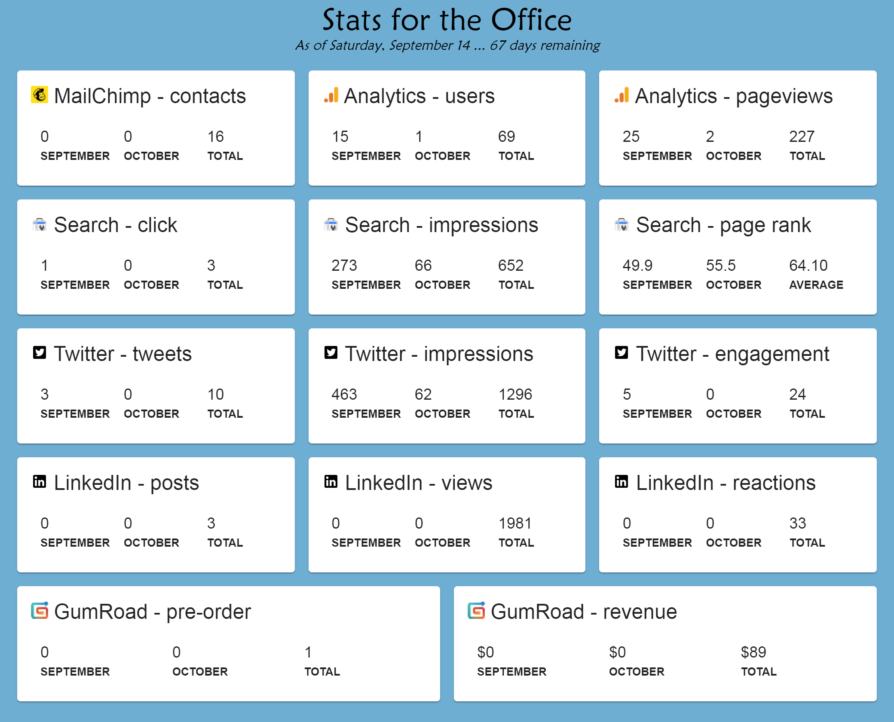
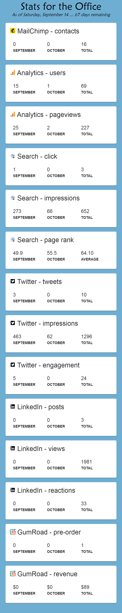
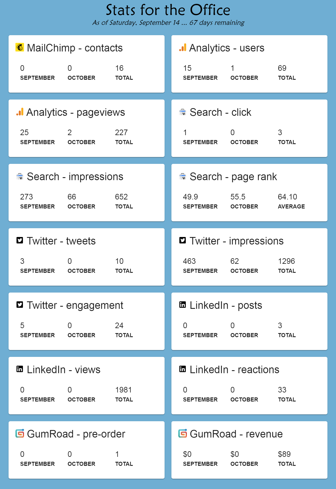

# Stats for the Office

- Provide a chronicle
- Timeseries of engagement statistics

No longer updated, but provided responsive, month-over-month metrics.

<table style="text-align: center;">
    <tr>
        <td></td>
        <td rowspan="2"></td>
    </tr>
    <tr>
        <td></td>
    </tr>
</table>

## Technology
Producing pre-rendered content for use by a static host. This is a single component `./src/app.component` which is served and rendered with './prerender.ts`.

### Development server
`ng serve --open`

### Production Prerender
`npm run build:prerender`
